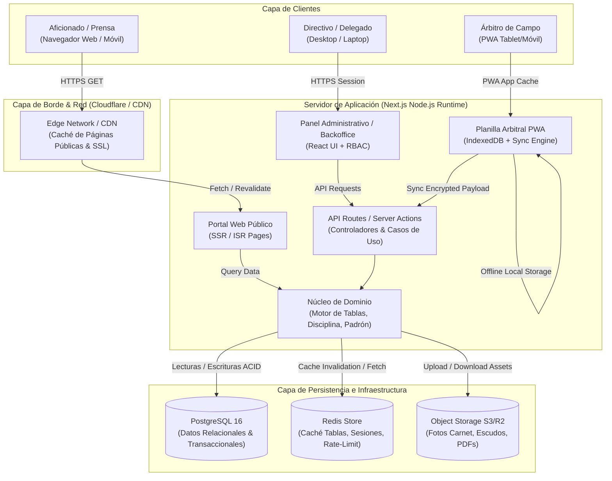
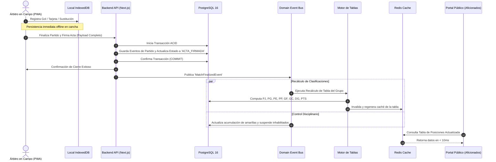
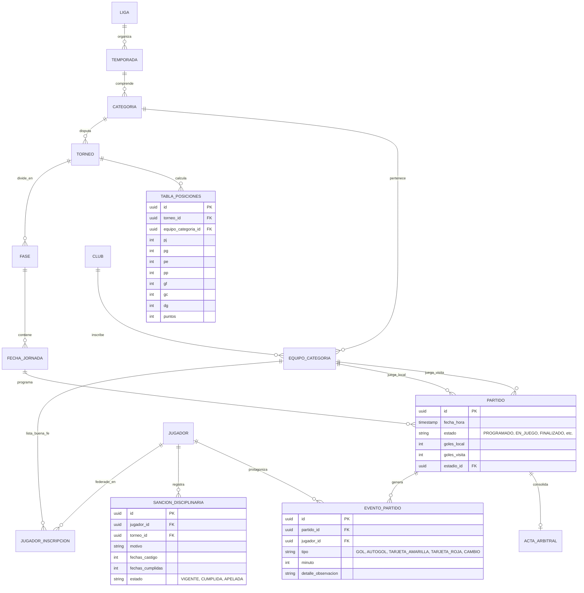

# DOCUMENTO DE ARQUITECTURA DE SOFTWARE (SAD)
## Plataforma de Gestión y Difusión para Liga Provincial de Fútbol
**Estándar de Referencia:** IEEE/ISO/IEC 42010 / Modelo C4 & 4+1 Vistas  
**Código del Documento:** LPF-SAD-003  
**Versión:** 1.0.0  
**Fecha:** 08 de Octubre de 2026  
**Líder de Arquitectura:** Lead Systems Engineer & Solutions Architect  
**Estado:** Arquitectura Base Aprobada  

---

## 1. INTRODUCCIÓN Y DRIVERS ARQUITECTÓNICOS

El diseño arquitectónico de **LPF-Manager** responde a necesidades críticas del negocio y a la realidad operativa de las canchas de fútbol provinciales:

1. **Dualidad de Cargas de Trabajo (Read vs. Write Heaviness):**
   - **Lectura Masiva (Read-Heavy):** El portal público experimenta picos de tráfico intensos (fines de semana al cierre de jornadas), donde miles de aficionados consultan simultáneamente tablas de posiciones y marcadores. Requiere renderizado estático con revalidación incremental (ISR) y caché en borde (Edge CDN).
   - **Escritura Crítica y Transaccional (Write-Critical):** La carga de actas arbitrales y cómputo de posiciones exige estricta consistencia transaccional (ACID). Un gol o tarjeta no puede quedar en estado intermedio ni provocar carreras de datos (*race conditions*).
2. **Resiliencia ante Desconexión en Cancha (Offline-First en Acta):**
   - Los árbitros operan frecuentemente en estadios municipales con cobertura de telefonía móvil deficiente o intermitente. La planilla arbitral debe persistir eventos localmente y sincronizarlos de forma transaccional e idempotente al detectar conectividad.
3. **Mantenibilidad y Simplicidad Operativa:**
   - Evitar la sobre-ingeniería de microservicios prematuros. Se selecciona un **Monolito Modular** fuertemente tipado que minimiza la fricción de despliegue, garantiza cohesión de dominio y permite evolucionar a servicios distribuidos solo si la escala federativa lo demanda.

---

## 2. STACK TECNOLÓGICO SELECCIONADO Y JUSTIFICACIÓN TÉCNICA

| Capa / Subsistema | Tecnología Seleccionada | Justificación Técnica de Ingeniería |
| :--- | :--- | :--- |
| **Plataforma / Runtime** | **Node.js (LTS v22+) & TypeScript** | Tipado estricto extremo (`strict: true`), ecosistema maduro, unificación de lenguaje en frontend y backend. |
| **Framework Fullstack** | **Next.js (App Router)** | Permite arquitectura híbrida: SSR / ISR para páginas públicas con SEO y máxima velocidad; Client Components para el Backoffice interactivo; Server Actions y Route Handlers para lógica de backend segura. |
| **Diseño y Estilos** | **Vanilla CSS Moderno / CSS Modules** | Máximo control estético, cero dependencia de librerías pesadas, rendimiento óptimo, variables nativas para temas claro/oscuro y efectos visuales de alta gama (glassmorphism, animaciones fluidas). |
| **Base de Datos Principal** | **PostgreSQL 16+** | Motor relacional estándar de la industria. Indispensable por integridad referencial estricta, claves foráneas, restricciones de unicidad (DNI único, pases no duplicados) y soporte de transacciones ACID para actas. |
| **Capa ORM / Acceso Datos** | **Prisma ORM o Drizzle ORM** | Generación de consultas tipadas de extremo a extremo, migraciones declarativas y protección intrínseca contra inyecciones SQL. |
| **Caché y Mensajería Local** | **Redis (Upstash / KeyDB)** | Caché en memoria para tablas de posiciones precalculadas, rate-limiting de endpoints y cola de procesamiento de eventos en segundo plano. |
| **Almacenamiento de Archivos** | **S3-Compatible (Cloudflare R2 / AWS S3)** | Almacenamiento seguro y económico para fotos de carnet de jugadores, escudos de clubes, actas en PDF y comprobantes de pases. |
| **PWA & Offline Engine** | **Workbox + Dexie.js (IndexedDB)** | Service Worker para caché de assets de la aplicación y base de datos local embebida en el navegador del árbitro para persistencia offline de eventos. |
| **Validación de Esquemas** | **Zod** | Validación universal en runtime de DTOs, formularios en cliente y cargas de API en backend compartiendo el mismo esquema. |

---

## 3. PATRONES DE ARQUITECTURA Y DISEÑO

### 3.1 Monolito Modular con Separación por Capas
La solución se organiza en módulos de dominio desacoplados dentro del mismo repositorio:
- `modules/competitions`: Temporadas, torneos, fases, grupos y fixture.
- `modules/clubs`: Clubes, canchas, directivas.
- `modules/players`: Padrón, fichajes, transferencias y carnets con código QR.
- `modules/matches`: Planilla arbitral, actas, eventos de juego y estados del partido.
- `modules/standings`: Motor de cálculo de tablas y estadísticas individuales.
- `modules/discipline`: Acumulación de tarjetas, sanciones y resoluciones del tribunal.
- `modules/portal`: Servicios de difusión pública, noticias y contenidos multimedia.

### 3.2 Patrón de Máquina de Estados (State Machine) para el Partido
El ciclo de vida del encuentro sigue transiciones formales controladas:

```
[ PROGRAMADO ] 
      │  (Carga de nóminas por delegados)
      ▼
[ ALINEACIONES_CONFIRMADAS ] 
      │  (Pitazo inicial por el árbitro)
      ▼
[ EN_JUEGO ] ◄───► [ ENTRETIEMPO ]
      │  (Pitazo final)
      ▼
[ FINALIZADO ] 
      │  (Cierre con firma arbitral)
      ▼
[ ACTA_FIRMADA ] ───► Dispara Evento: `MatchFinalizedEvent`
      │                ├─► Recalcular Tablas de Posiciones
      │                └─► Evaluar Acumulación de Tarjetas (Sanciones)
      ▼
[ VALIDADO_LIGA ] (Aprobación administrativa por Comité de Torneo)
```

### 3.3 Eventos de Dominio en Proceso (In-Process Domain Events)
Al confirmarse el estado `ACTA_FIRMADA`, se emite de forma transaccional el evento de dominio `MatchFinalizedEvent`. Los listeners desacoplados reaccionan ejecutando:
1. `RecalculateStandingsHandler`: Recalcula la tabla de posiciones de la categoría afectada y purga la caché de Redis.
2. `CheckDisciplinaryCardsHandler`: Evalúa tarjetas amarillas y rojas del partido, actualiza contadores por atleta y genera registros preventivos de inhabilitación si se alcanza el umbral.
3. `AuditTrailHandler`: Asienta el cierre del acta en la bitácora inmutable de auditoría.

---

## 4. DIAGRAMAS DE ARQUITECTURA (C4 MODEL Y FLUJOS)

### 4.1 Diagrama de Contenedores (C4 Container Diagram)



---

### 4.2 Flujo de Datos: Registro de Partido y Actualización Automática



---

## 5. MODELO DE DATOS Y DOMINIO CONCEPTUAL (ER DIAGRAM)



---

## 6. SEGURIDAD, POLÍTICAS Y AUDITORÍA

1. **Autenticación y Autorización Granular:**
   - Sesiones gestionadas con cookies criptográficamente firmadas `HttpOnly`, `SameSite=Lax`, `Secure`.
   - Middleware de Next.js para interceptar rutas y evaluar el rol requerido antes de acceder a cualquier pantalla o endpoint administrativo.
2. **Protección de Datos e Identidad (Carnet QR):**
   - El código QR impreso en el carnet físico no contendrá datos planos vulnerables, sino un JSON Web Token (JWT) firmado con clave privada por el servidor de la liga, con tiempo de expiración y verificación de firma digital. Cualquier alteración física invalidará el escaneo del árbitro.
3. **Auditoría Inmutable:**
   - Tabla `bitacora_auditoria` que almacena: `id`, `usuario_id`, `entidad`, `accion` (`INSERT`, `UPDATE`, `DELETE`), `payload_anterior`, `payload_nuevo`, `ip_origen`, `created_at`. No permite eliminación ni modificación (`append-only`).

---

## 7. ESTRATEGIA DE DESPLIEGUE, DEVOPS Y OBSERVABILIDAD

### 7.1 Pipeline de CI/CD (GitHub Actions)
1. **Linting & Type-Checking:** Ejecución de ESLint y `tsc --noEmit` para asegurar calidad y compatibilidad.
2. **Test Suite:** Pruebas unitarias en Vitest para lógica de desempates, cómputo de actas y sanciones.
3. **Build:** Construcción del contenedor Docker de producción multi-etapa (*multi-stage build*) optimizado en tamaño (<150 MB).
4. **Deploy:** Despliegue automatizado sin tiempo de inactividad (*Zero-Downtime Rolling Update*).

### 7.2 Infraestructura de Producción
- **Servidor Web / Aplicación:** Contenedor Docker Node.js sobre VPS Linux (Ubuntu Server) orquestado con Docker Compose / Coolify o desplegado en Vercel.
- **Base de Datos:** Instancia gestionada de PostgreSQL (e.g., Supabase / Neon o Postgres local optimizado con conexión pooled mediante PgBouncer).
- **Reverse Proxy & SSL:** Nginx o Caddy con aprovisionamiento automático de certificados SSL Let's Encrypt y compresión Brotli/Gzip.
- **Monitoreo & Logs:** Registro centralizado con Pino/Winston y telemetría de errores con Sentry en frontend y backend.
